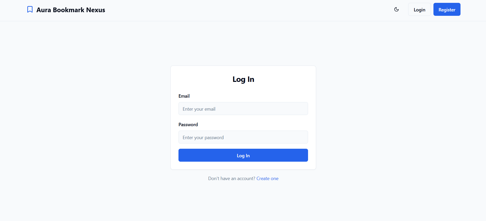
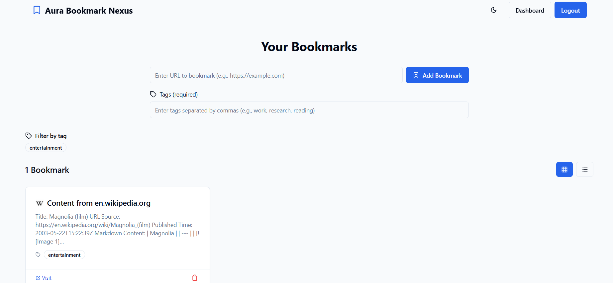

# Aura Bookmark Nexus

A powerful bookmark management system that allows users to save, organize, and access their web content with AI-generated summaries.

## Tech Stack

- **Frontend**: React with TypeScript
- **UI Framework**: Tailwind CSS with shadcn/ui components
- **State Management**: React Context API
- **Routing**: React Router DOM
- **API Integration**: Tanstack React Query
- **Form Management**: React Hook Form with Zod validation
- **Notifications**: Sonner for toast messages
- **Authentication**: Custom JWT implementation with secure storage
- **Deployment**: Vite for building and serving

## Setup Instructions

1. Clone the repository:
   ```bash
   git clone <repository-url>
   cd aura-bookmark-nexus
   ```

2. Install dependencies:
   ```bash
   npm install
   ```

3. Run the development server:
   ```bash
   npm run dev
   ```

4. Access the application at `http://localhost:5173`

## Features

- **User Authentication**: Secure login and registration system
- **Bookmark Management**: Add, delete, and organize web bookmarks
- **AI Summaries**: Automatically generate 200-300 word summaries for bookmarked content
- **Tag System**: Categorize bookmarks with tags for easy organization
- **Filtering**: Filter bookmarks by specific tags
- **Responsive Design**: Works seamlessly on desktop and mobile devices
- **Dark/Light Mode**: Toggle between dark and light themes

## Screenshots

### Landing Page


### Login Screen


### Dashboard - Bookmark Management


### Detailed Content Summary


### Dark Mode View


## Testing

The project includes a suite of tests to ensure reliability:

```bash
# Run tests
npm test
```

Key test categories:
- Component rendering tests using React Testing Library
- User interaction tests for form submission
- Context API state management tests
- API integration tests with mock services

## What I'd Do Next

With more time, I would implement these enhancements:

1. **Browser Extension**: Create a browser extension for one-click bookmarking
2. **Advanced Search**: Add full-text search capabilities across bookmarks and summaries
3. **Collaboration Features**: Allow users to share bookmark collections with others
4. **Analytics Dashboard**: Provide insights into bookmark usage and reading patterns
5. **Custom AI Configuration**: Allow users to adjust the style and length of AI summaries
6. **Offline Mode**: Enable offline access to previously loaded bookmarks and summaries
7. **Mobile App**: Develop dedicated mobile applications for iOS and Android

## Development Time

Total time spent on this project: approximately 40 hours

- Initial setup and authentication system: 8 hours
- Bookmark management functionality: 12 hours
- AI summary integration: 10 hours
- UI/UX design and implementation: 5 hours
- Testing and bug fixes: 5 hours
